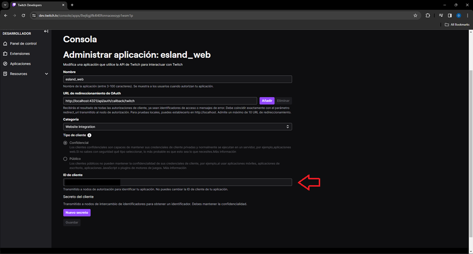
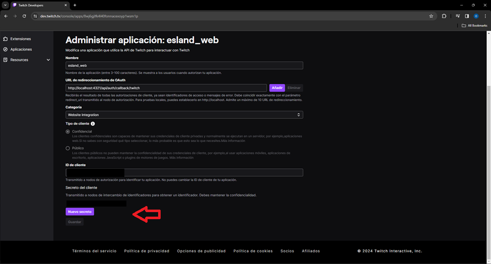

<div align="center">
 
<h3>
 The ESLAND page re-imagined
</h3>
<p>Created for didactic and educational purposes.</p>
</div>

<div align="center">
    <a href="#" target="_blank">
        Preview
    </a>
    <span>&nbsp;✦&nbsp;</span>
    <a href="#-getting-started">
        Getting Started
    </a>
    <span>&nbsp;✦&nbsp;</span>
    <a href="#-commands">
        Commands
    </a>
    <span>&nbsp;✦&nbsp;</span>
    <a href="#-license">
        License
    </a>
    <span>&nbsp;✦&nbsp;</span>
    <a href="https://www.youtube.com/c/midudev">
        YouTube
    </a>
    <span>&nbsp;✦&nbsp;</span>
    <a href="https://twitter.com/midudev">
        Twitter
    </a>
</div>

<p></p>

<div align="center">


</div>

> [!WARNING]
> This page is not official. The official page is [**premiosesland.com**](https://premiosesland.com/).

## 🛠️ Stack

- [**Astro**](https://astro.build/) - The web framework for content-driven websites.
- [**Typescript**](https://www.typescriptlang.org/) - JavaScript with syntax for types.
- [**Tailwindcss**](https://tailwindcss.com/) - A utility-first CSS framework for rapidly building custom designs.
- [**tailwindcss-animated**](https://github.com/new-data-services/tailwindcss-animated) - Extended animation utilities for Tailwind CSS.
- [**fontsource**](https://fontsource.org/) - Self-host Open Source fonts in neatly bundled NPM packages.

## 🚀 Getting Started

1. [Fork](https://github.com/midudev/esland-web/fork) or clone this repository.

```bash
git clone git@github.com:midudev/esland-web.git
```

2. Install the dependencies:

- We use [bun](https://bun.sh) to install and manage the dependencies.

```bash
# Install bun for MacOS, WSL & Linux:
curl -fsSL https://bun.sh/install | bash

# Install bun for Windows:
powershell -c "iwr bun.sh/install.ps1|iex"

# Install with bun:
bun install
```

- or you can use [pnpm](https://pnpm.io):

```bash
# Install pnpm globally if you don't have it:
npm install -g pnpm

# Install dependencies:
pnpm install
```

3. Run the development server:

```bash
# Run with bun:
bun dev

# Run with pnpm:
pnpm dev
```

4. Open [**http://localhost:4321**](http://localhost:4321/) with your browser to see the result 🚀

### 🤝 Contributing

<a href="https://github.com/midudev/esland-web/graphs/contributors">
  
</a>

## 🔑 Get your Twitch client ID and secret

Before being able to initialize the application, you will need to obtain your ***client ID*** and ***client secret*** from Twitch.

First, you must to go to [dev.twitch.tv](https://dev.twitch.tv)

Once you're there, you should to click on the button that says **'your console'** in the upper right corner.


When you're in the console page. You create a new app in the **'apps'** section and press the button that say's 'register your app'


Then you'll need to register your app. Fill the fields as teh follow example and click the **'create'** button.


After that, the page will redirect you to the admin panel. Look for the application you just created and click on the **'manage'** button.


You'll go to the same page where you were when you registered your app. Scroll down, and you'll find your ***client ID*** as shown below:



Finally, you'll need your ***client secret***. Below the place where you obtained your ***client ID***, you'll find the **'new secret'** button; click on it to get your secret.



Don't forget that add it to your `.env` file

## 🧞 Commands

|     | Command          | Action                                        |
| :-- | :--------------- | :-------------------------------------------- |
| ⚙️  | `dev` or `start` | Starts local dev server at `localhost:3000`.  |
| ⚙️  | `build`          | Build your production site to `./dist/`.      |
| ⚙️  | `preview`        | Preview your build locally, before deploying. |

## 🔑 License

[MIT](#) - Created by [**midu.dev**](https://midu.dev).

## ✅ Por hacer...

- [ ] Mejorar diseño de la página "Info"
- [ ] Añadir funcionalidad de ganadores de pasadas ediciones
- [ ] Mejorar la precarga de las imágenes de las siguientes secciones en idle
- [ ] Pestaña para cambiar entre ediciones en la página "Archivo"

### 👀 Lo haremos en directo en Twitch

- [ ] Base de datos para las votaciones
- [ ] Backend para las votaciones